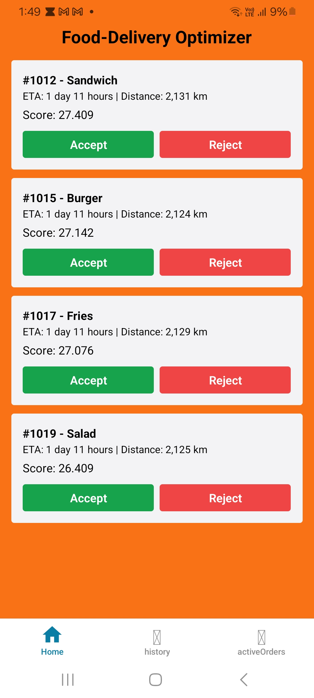
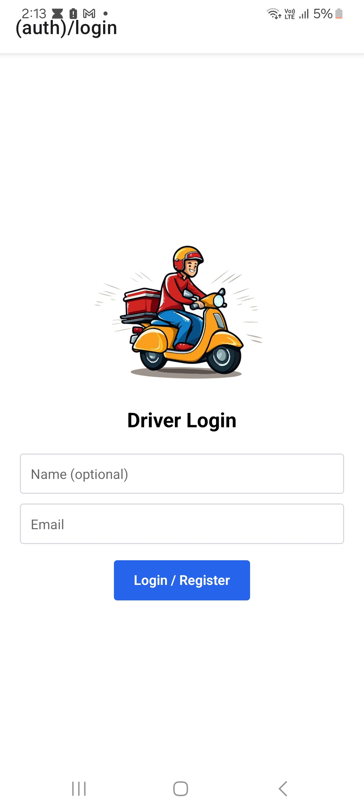
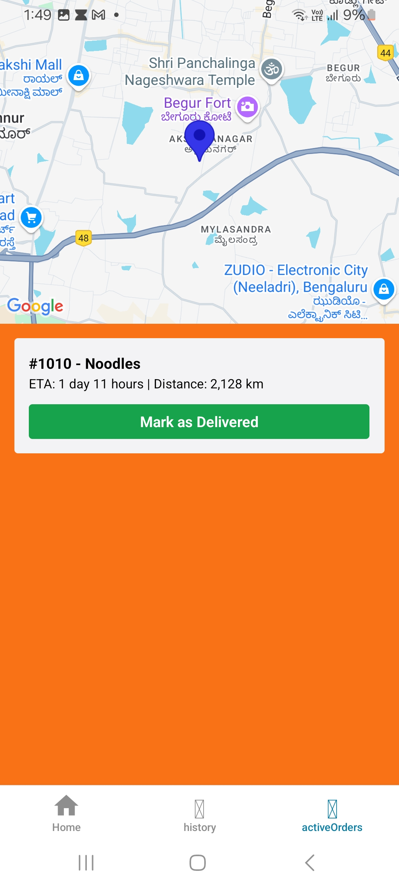
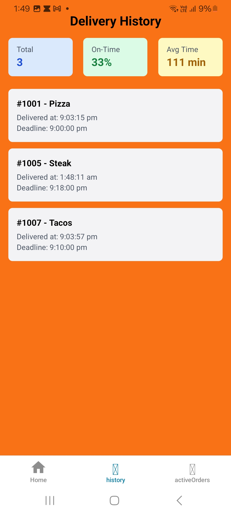
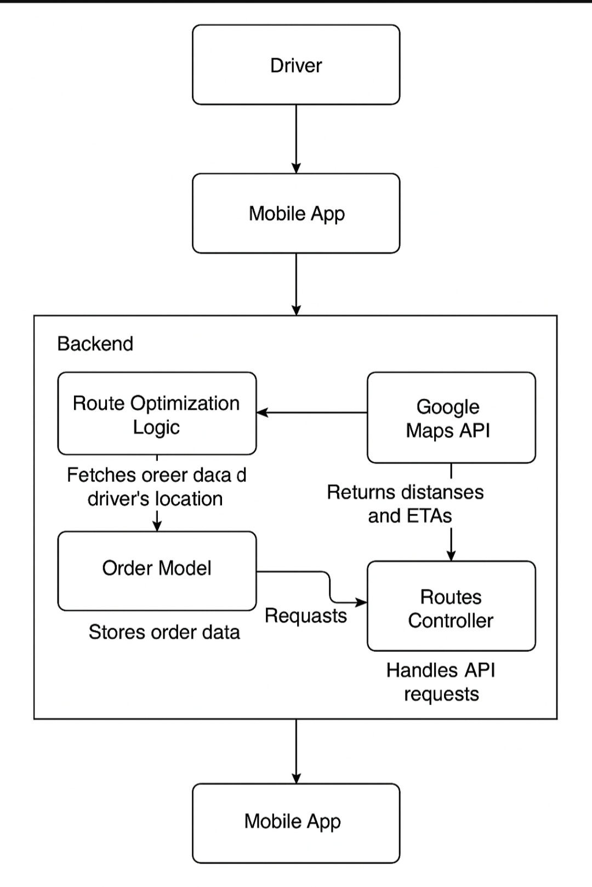

# 📦 Last Mile Food Delivery Optimization App

> **Author**: Amar Kumar  
> **Submission Date**: [2025-05-09]  
> **Assignment**: LE Hiring - Final Technical Assignment  
> **Duration**: 2 Days  

---

## 🚀 Overview

This app is designed to help a single delivery driver optimize the delivery of 5–6 food orders while considering real-world constraints like perishability (e.g., ice cream), priority, and deadlines. The system includes:

- 🌐 A cloud-deployed REST API (Render)
- 📱 A mobile app built with React Native + Expo
- 📊 Algorithmic prioritization of routes
- 🗂️ Documentation + diagrams + deployment ready

---

## 📚 Table of Contents

- [Features](#features)
- [Architecture](#architecture)
- [Backend](#backend)
- [Mobile App](#mobile-app)
- [Data](#data)
- [Route Optimization](#route-optimization)
- [Deployment](#deployment)
- [Screenshots](#screenshots)
- [Assumptions](#assumptions)
- [UML & Diagrams](#uml--diagrams)
- [How to Run](#how-to-run)
- [Future Improvements](#future-improvements)

---

## ✅ Features

| Module             | Functionality                                                                 |
|--------------------|------------------------------------------------------------------------------|
| 📦 Order Intake     | Accepts new orders with location, priority, deadline, type                  |
| 📍 Route Engine     | Optimizes based on distance, priority, perishability using Google API       |
| 🚗 Driver App       | Driver can accept/reject orders, see routes and mark deliveries as complete |
| 📊 History View     | Visual dashboard for completed deliveries with metrics                      |
| 🔐 Auth Light       | Drivers login using email; ID is stored in AsyncStorage                     |
| ☁️ Cloud Deployment | All APIs are deployed on Render                                              |

---

## 🧱 Architecture

```
[React Native App]
     |
     | REST API calls
     v
[Express.js Backend (Render)]
     |
     | -> MongoDB Atlas
     | -> Google Maps Distance Matrix API
```

---

## ⚙️ Backend

- **Framework**: Node.js + Express
- **Database**: MongoDB Atlas
- **Routes**:
  - `POST /api/orders` — Add order
  - `POST /api/driver/:id/active-route` — Get prioritized orders
  - `POST /api/order/:id/complete` — Mark as delivered
  - `POST /api/order/:id/reject` — Cancel/release order
  - `GET /api/driver/:id/history` — View delivery history
- **Priority Factors**:
  - Order priority
  - Delivery deadlines
  - Perishable items (ice cream)
  - Distance from driver

---

## 📱 Mobile App

Built using **React Native + Expo** with Tailwind CSS for styling.

### Screens:
- **Login** — Set driver ID via email
- **Home** — View 5 prioritized orders
- **Active Orders** — Map + "Mark as Delivered"
- **History** — Past deliveries + metrics
- **Logout** — Clear AsyncStorage and redirect


---

## ⚡ Performance & Reliability

### 🧠 Smart Caching (React Native)
- Used **AsyncStorage** to cache driver ID and accepted orders
- Reduces unnecessary API calls on each screen load
- Cached data is auto-cleared on logout

### 🌐 Network Handling
- Optimized with **Axios** interceptors and error boundaries
- Graceful fallback when offline (displays cached orders)
- Loading indicators and error alerts shown for network failures

### 📲 Implementation Highlights
- Cached previously fetched delivery routes to reduce Google Maps API calls
- Revalidates fresh data using `useFocusEffect` on tab switch
- Handles edge cases like:
  - API down → fallback to local storage
  - Location permission denied → warning shown


---

## 📊 Route Optimization

### Inputs:
- Driver's current GPS location (via Expo Location)
- Customer lat/long
- Google Distance Matrix

### Logic:
1. Filter high-priority and perishable items
2. Use Google API to get durations/distances
3. Sort top 5 based on:
   - Priority
   - Shortest ETA
   - Product type weight (ice cream > pizza)

---

## 📦 Dataset

Used a **simulated dataset** of 30 orders, based on schema:

| order_id | product_type | delivery_priority | customer_lat | customer_long | delivery_deadline |
|----------|---------------|-------------------|---------------|----------------|--------------------|
| 1001     | Ice Cream     | High              | 28.6139       | 77.209         | 2025-01-01T12:00Z |

(Stored in MongoDB via `.json` import)

---

## 🌐 Deployment

- 🔗 Render Backend: `https://food-delivery-optimization.onrender.com`
- 🔐 Environment Variables:
  - `GOOGLE_API_KEY`
  - `MONGO_URI`

---

## 📷 Screenshots

Here are some screenshots showcasing the app's functionality:

- **🏠 Home Page**  
  

- **🗺️ Registration/Login Page**  
  

- **📊 Active Order Page**  
  

- **✅ Driver Order History Page**  
  

---

## 📝 Assumptions

- Each order belongs to a single driver
- Driver can cancel only before accepting
- Prioritization logic prefers perishable and urgent items
- Routes fetched only on tab focus for speed

---

## 🔄 How to Run

### Backend:
```bash
npm install
npm run dev
```

### Mobile:
```bash
cd mobile-app
npx expo start
```

## 📦 Mobile App Download

You can download and test the mobile APK here:

👉 [Download APK](https://expo.dev/artifacts/eas/6ja114d9Wc9mp8Uv3TYJV9.apk)

> Built using Expo + React Native. Tested on Android 10+.


Update `.env` or `constants.js` with your backend base URL.

---

## 📷 UML Diagram



---

## 🚀 Future Improvements

- Add Firebase/Auth0 login with roles
- Polyline route map between orders
- Admin dashboard for viewing all orders
- Driver performance leaderboard
